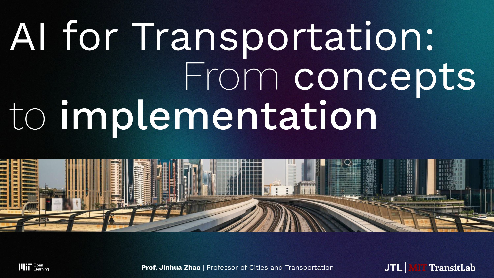

# MIT Urban AI 2025 Course | Transportation - AI for Transportation: From concepts to implementation

**Course Link:** 

Welcome to the MIT Open Learning Urban AI (UAI) course! This section is presented by Professor Jinhua Zhao, professor for cities and transportation at the MIT Department of Urban Studies and Planning (DUSP). Through a series of four lectures, we will cover the following topics:

- Lecture 1: Introduction 
- Lecture 2: AI Models and Approaches
- Lecture 3: Real-World AI Case Studies
- Lecture 4: Generative AI

## Lectures

In the `lectures` folder, you can find all of the slides used for the presentation of the material, together with READMEs linking the lecture recordings published on YouTube. Each lecture is subdivided into sections, to enable piecewise progression and learning in the course.

## Recitations

Each lecture is also accompanied with a respective recitation, which will enable you to learn more on the topic, while also applying the knowledge you have gather through the respective session of the course. Each recitation has multiple sections and features a set of slides, small quizzes on the EdX platform, and optionally Google Colab notebooks. The latter notebooks are meant to provide you with an opportunity to experience, in a very hands-on matter, the current cutting edge applications of specialized AI models for urban mobility tasks. In these recitations we will cover:

- Recitation 1: Grounded AI
- Recitation 2: Discrete Choice Modeling
- Recitation 3: Multi-Modal AI for Transit Data
- Recitation 4: Generative Urban AI

For each of these recitations, we will provide a homework-styled, self-paced exercise sheet, which allows you to attempt the exercises and questions discussed in the recitations by yourself, to enhance your learning experience. We generally recommend you to attempt the homework sheets first, followed by watching the recitation videos and at the sample solutions, if available.

## Homeworks

In the `homeworks` folder, you will find all homework-styled problems sheets for the respective recitation. You will be asked to either reflect on contents from the lecture or to complete a Google Colab notebook. The recordings to the recitations will provide you, afterwards, with more context, while the solution notebooks in the `recitations` folders are sample solutions to what you were asked to fill out. 

